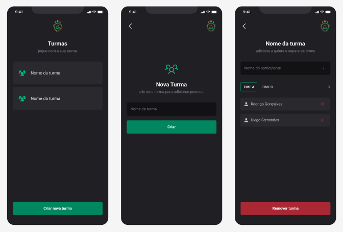

# I'm Here


  
  <br>

> Este é um aplicativo mobile simples usando React Native. faz parte do módulo 02 da [Rocketseat](http://app.ropcketseat.com.br)



## Detalhes do aplicativo

- Trata-se de um aplicativo simples que cria turmas e adiciona participantes por grupo A ou B.

## 💻 Como usar o projeto
Para gerar uma cópia do projeto e implementar as suas melhorias, esteja em um computador com Node Js instalado e siga as etapas abaixo:

1  clone o projeto com o comando 
```
git clone https://github.com/oeujack/teamsapp
``` 
2  Acesse o projeto pelo terminal com o comando 
```
cd teamsapp
```  
3  Instale as dependências necessárias com o comando
```
npm install
```

4  Rode o projeto com o comando
```
npm expo start
``` 
5  Acesse o aplicativo em seu dispositívo físico com o app Expo Go ou pelo Android Studio 

## 🌐 Links úteis
[NodeJS](https://nodejs.org/en/download)  
[Expo](https://expo.dev/)  
[Android Studio](https://developer.android.com/studio/install?hl=pt-br)  
[Figma do projeto](https://www.figma.com/community/file/1151864427495057381)


## 🧑‍💻 Jackson dos Santos
[](https://www.linkedin.com/in/jackson-dos-santos/)
[](https://github.com/oeujack)
